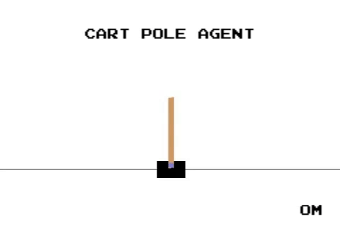

# Reinforcement_Learning
A repository for studying reinforcement learning.

## Cart Pole
As a first step, I taught my agent to master Cart Pole! 

Pretty cool huh?
More details can be found in the Cart Pole notebook.

## Mountain Car
Moving on to Mountain Car: 

## Lunar Lander
This agent can land on the moon with just one hidden layer of 50 nodes! 

